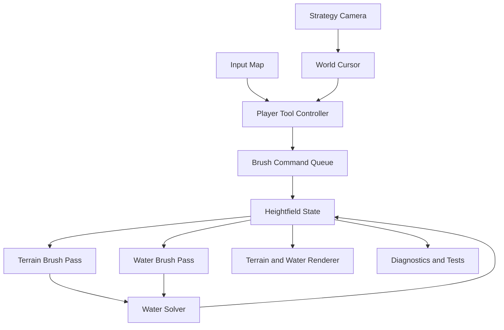

# The Levels

## Game overview and first MVP

> [!summary] Core decision
> Build **The Levels** in Godot 4 as an environmental god game set in a mythic version of the ancient Somerset Levels. The first MVP has one purpose: prove that moving earth and water is tactile, readable, stable, and fun. Everything else waits.

![[The levels look feel.jpg|900]]

## Vision

**The Levels** is a landscape-manipulation game inspired by the flooded wetlands, peat islands, rhynes, trackways, and tors of Somerset. The player is an unseen spirit of the land, represented through a restrained spiral of golden-white **Awen** energy. Rather than controlling characters directly, the player reshapes earth and redirects water.

The landscape is the central character. Water should seek low ground, fill channels, gather behind banks, and overtop weak points. Earth removed from one place becomes a resource that can be carried and deposited elsewhere. A small terrain edit should be capable of changing the behaviour of the whole local water system.

The intended full game may later include Druidic communities, sacred places, trackways, rituals, seasons, and environmental threats. Those ideas provide the world and tone, but they are **not part of the first MVP**.

## Design pillars

### The world behaves as one system

Terrain, water, and player actions share the same heightfield. A river is not a scripted path; it is water responding to the ground beneath it. A bank works because it is higher than the water surface, not because it has a special “dam” tag.

### Manipulation is physical and conserved

The player cannot paint unlimited matter. Scooped earth or water enters a finite carried buffer. Dropping matter removes it from that buffer. The game should communicate that matter is being moved, not created.

### Consequences are immediately readable

The cursor, terrain shape, water direction, carried amount, and result of an edit must be understandable at the normal gameplay camera distance. Debug views may explain the simulation during development, but the ordinary visual response should tell the story.

### Somerset shapes the game

Low floodplain, raised islands, winding drainage channels, peat, clay, reeds, and a distant tor give the prototype its identity. The setting should influence the test map even while art remains simple.

### Magic belongs to the landscape

The Awen presence is organic, quiet, and elemental. It supports the interaction without covering the terrain in effects or turning the game into ornate high fantasy.

## First MVP objective

Create one repeatable sandbox level, working title **The First Rhyne**, in which the player can:

1. Scoop earth from the deformable terrain.
2. Carry a limited volume of earth and drop it elsewhere.
3. Pick up water from a pool or channel.
4. Carry a limited volume of water and drop it elsewhere.
5. Watch water flow downhill and collect in low areas.
6. Dig a channel that attracts water.
7. Build an earth bank that blocks water until it overtops.
8. Reset the entire simulation to an identical starting state.

The MVP has no formal win state. It is a simulation and interaction proof, not a vertical slice of the complete game.

## Player experience

The camera opens above a compact wetland landscape. A raised mossy island sits near the centre, surrounded by lower peat flats. A shallow winding rhyne links an upper pool with a lower basin. A mound provides enough earth for repeated experiments, while a narrow gap creates an obvious place to build a bank.

The player should discover three experiments naturally:

- Remove earth to deepen or cut a water route.
- Deposit earth to retain or redirect water.
- Lift water from a low area, place it on higher ground, and watch it find a new route downhill.

The experience should feel calm and exploratory. There is no time pressure, population to protect, or failure punishment in this build.

## Visual direction

Use the embedded image as a **look-and-feel reference**, not as a requirement for MVP production art.

- Elevated three-quarter gameplay view with clearly readable heights and paths.
- Cool mist over broad wetlands with restrained warm dawn light.
- Peat brown, clay brown, muted moss green, reed gold, grey stone, and slate-blue water.
- Softly shaped islands with exposed banks and shallow channels.
- Wet surfaces that catch light without becoming mirror-like.
- A subtle amber-white Awen cursor as the only magical highlight.
- Open terrain around interaction areas so water movement is easy to read.

For the MVP, flat colours, simple materials, basic fog, and primitive geometry are sufficient. Villagers, roundhouses, standing stones, vegetation density, and trackways shown in the image belong to later visual development.

## MVP scope

### Included

- One greybox island-and-wetland test map.
- Runtime-deformable heightmap terrain.
- Earth scoop and earth drop.
- Water pickup and water drop.
- Separate finite earth and water buffers.
- Water flowing downhill, pooling, and overtopping low banks.
- Water reacting to terrain edits on the next simulation step.
- Elevated camera with pan, rotate, zoom, and cursor focus.
- World-space brush cursor and active-material feedback.
- Pause, single-step, and full reset.
- Debug metrics and deterministic test scenarios.
- Placeholder terrain, water, fog, lighting, and Awen visuals.

### Explicit non-goals

- Villagers, Druids, tribes, AI, pathfinding, settlements, or population simulation.
- Stone circles, rituals, powers, progression, resources, missions, or narrative.
- Lava, fire, wind, storms, tides, seasons, or multiple fluid types.
- Erosion, sediment, deposition, mud simulation, terrain slumping, or landslides.
- Trackways, buildings, vegetation simulation, wildlife, or destructible props.
- Production art, animation, audio, cinematics, menus, or a polished tutorial.
- Saving, networking, gamepad support, mobile support, or localization.
- Infinite terrain, streaming worlds, or a general-purpose level editor.
- Physically exact fluid dynamics.

If a task does not improve earth movement, water movement, simulation stability, controls, readability, testing, or performance, defer it.

## Test map specification

| Property | Initial target |
|---|---:|
| Play area | 128 m × 128 m |
| Simulation grid | 256 × 256 cells |
| Cell size | 0.5 m |
| Terrain height range | Approximately 0–16 m |
| Boundary | Closed for MVP testing |
| Camera | Perspective, elevated three-quarter view |
| Starting water | Upper pool, shallow rhyne, lower basin |

The map should contain:

- One central dry island.
- One broad low floodplain.
- One winding shallow rhyne.
- One narrow damming point.
- One movable earth mound.
- One high shelf for downhill-release tests.
- One lower receiving basin.
- A visible edge treatment so closed boundaries feel intentional.

## Controls

Define controls through Godot's **Input Map**, not hard-coded device checks.

| Default input | Action |
|---|---|
| `1` | Select Earth |
| `2` | Select Water |
| Hold left mouse | Scoop selected matter |
| Hold right mouse | Drop carried matter |
| `WASD` or middle-mouse drag | Pan camera |
| Mouse wheel | Zoom |
| `Q` and `E` | Rotate camera |
| `F` | Focus camera on cursor |
| `R` | Reset terrain, water, buffers, camera, and metrics |
| `Space` | Pause or resume simulation |
| `N` | Advance one step while paused |
| `F1` | Toggle diagnostics |

The cursor should follow the visible terrain or water surface, show the brush radius, change colour with the selected element, and indicate when the player cannot collect or deposit.

## Matter behaviour

### Earth scoop

- Apply a circular brush with smooth radial falloff to the ground-height grid.
- Convert removed height into cubic metres using cell area.
- Add the exact removed volume to the Earth buffer.
- Stop at the configured buffer capacity or minimum terrain height.
- Leave water volume unchanged; water settles because its bed height changed.

### Earth drop

- Raise terrain with the same radius and falloff.
- Remove the exact deposited volume from the Earth buffer.
- Stop when the buffer is empty or maximum terrain height is reached.
- Apply transfer at a per-second rate independent of rendering frame rate.

Earth does not slump or erode in the MVP. Unnatural steep piles are acceptable if water respects them and volume remains correct.

### Water pickup

- Remove only water depth inside the brush.
- Never reduce a cell below zero.
- Add the exact removed volume to the Water buffer.
- Stop when the buffer is full or no water remains beneath the brush.

### Water drop

- Add a shallow radial water column beneath the cursor.
- Remove the exact deposited volume from the Water buffer.
- Let the solver spread the water beginning with the next simulation step.
- Do not model a thrown projectile or splash physics in this build.

## Water simulation

Use a grid-based shallow-water approximation. Each cell stores ground height and water depth. Flow is driven by differences in total surface height:

`surface height = ground height + water depth`

Minimum solver behaviour:

- Flow to the four cardinal neighbours.
- Calculate pressure-driven outgoing flow across cell edges.
- Scale outgoing flow so a cell cannot transfer more water than it contains.
- Apply flows into a separate next-state buffer to avoid update-order bias.
- Use a fixed simulation timestep with configurable substeps.
- Pool in enclosed low areas.
- Overtop banks when the water surface rises above them.
- Use closed or reflective edges for the MVP.
- Clamp only negligible residual depths using a documented epsilon.
- Pause and report if NaN or Infinity appears.

Eight-neighbour flow, velocity advection, foam, erosion, and sediment are not required.

## Godot technical architecture

> [!important] Source of truth
> Use one authoritative simulation grid for ground height and water depth. Rendering, cursor targeting, debug views, and matter tools must all read or modify this same state.



### Recommended scene tree

```text
GameRoot
├── Simulation
│   ├── HeightfieldState
│   ├── SimulationRunner
│   └── Diagnostics
├── World
│   ├── TerrainRenderer
│   ├── WaterRenderer
│   └── WorldCursor
├── CameraRig
│   └── Camera3D
└── UI
    ├── MatterStatus
    ├── ControlsHint
    └── DebugOverlay
```

### Suggested scripts and responsibilities

| Script or resource | Responsibility |
|---|---|
| `simulation_config.gd` | Tunable grid, timestep, brush, capacity, threshold, and rendering values |
| `heightfield_state.gd` | Own authoritative ground, water, flow, and reset data |
| `simulation_runner.gd` | Fixed-step scheduling, substeps, pause, single-step, and reset |
| `matter_tool_controller.gd` | Selected matter, carried volumes, and brush-command creation |
| `world_cursor.gd` | Pointer-to-heightfield targeting and brush visualization |
| `strategy_camera.gd` | Pan, rotate, zoom, focus, and map bounds |
| `heightfield_renderer.gd` | Bind height/water state to terrain and water meshes/materials |
| `diagnostics_overlay.gd` | Timings, volume totals, grid values, correction counters, and test actions |

### Data representation

| Data | Initial representation | Production direction |
|---|---|---|
| Ground height | Packed float array or float image | GPU storage texture/buffer |
| Water depth | Packed float array or float image | GPU storage texture/buffer |
| Edge flow | Two or four float arrays | GPU storage buffers/textures |
| Earth buffer | Scalar volume in m³ | CPU gameplay state |
| Water buffer | Scalar volume in m³ | CPU gameplay state |
| Reset state | Immutable initial arrays/images | Resource or deterministic generator |

Start with a small CPU reference solver if that shortens the correctness loop. It should prove conservation and expected flow at 64² or 128². The 256² target should move simulation passes to Godot's `RenderingDevice` compute path if CPU profiling cannot meet the frame budget. Do not maintain two divergent gameplay implementations: the CPU path is a reference and test harness, not a permanent parallel architecture.

### Rendering

- Build terrain and water from regular grid meshes using `ArrayMesh`.
- Prefer shader vertex displacement from height textures once the GPU path is active.
- Render water as a second grid at ground height plus water depth.
- Hide dry cells below a small visual threshold.
- Use simple normal reconstruction and understated transparent water.
- Avoid rebuilding a complex physics collider every frame.
- Resolve the world cursor by intersecting the camera ray with the heightfield through grid sampling or ray marching.

### Simulation order

For each fixed simulation step:

1. Consume queued brush commands.
2. Apply earth changes and update the Earth buffer.
3. Apply water changes and update the Water buffer.
4. Calculate edge flows from neighbouring surface-height differences.
5. Scale outflows against water available in each donor cell.
6. Apply flows to the next water-depth state.
7. Clamp invalid or negligible values and update counters.
8. Publish the completed state to rendering and diagnostics.

## Debug metrics

The F1 overlay should display:

- Render FPS and frame time.
- Simulation-step time and substep count.
- Grid resolution and fixed timestep.
- Terrain volume in the world plus carried Earth volume.
- Water volume in the world plus carried Water volume.
- Earth and Water buffer fill and capacity.
- Wet-cell count and maximum water depth.
- Maximum flow observed in the latest sample.
- Negative corrections, height clamps, and invalid-value detections.
- Cursor cell, terrain height, water depth, and brush radius.

Developer actions should include reset, clear water, inject a known water volume, run a dam-and-release scenario, and advance one step while paused.

## Acceptance criteria

### Earth

- Scooping visibly lowers terrain under the cursor without perceptible input delay.
- Dropping raises terrain and cannot exceed the carried amount.
- After at least 50 scoop/drop actions, **world terrain volume plus carried Earth remains within 2%** of the starting total, excluding reported min/max clamps.
- Terrain edits affect water no later than the next simulation step.

### Water

- Pickup removes only water, never creates negative depth, and increases the carried amount correctly.
- Drop creates water at the target and cannot exceed the carried amount.
- After at least 50 pickup/drop actions, **world water volume plus carried Water remains within 2%** of the starting total.

### Flow

- Water placed on the high shelf reaches lower ground without a scripted path.
- Deepening the rhyne makes water prefer that lower route.
- A raised earth bank blocks shallow flow.
- Adding enough water causes overtopping at the lowest bank point rather than leakage through the bank.
- Pausing freezes the state; single-step advances exactly one configured step.
- A 10-minute soak test produces no invalid numbers, negative depth, runaway height, or unrecoverable corruption.

### Controls and clarity

- Camera pan, rotate, zoom, focus, and bounds work throughout the map.
- The cursor stays aligned with the visible heightfield while the camera moves.
- A first-time internal tester can identify the selected matter, carried amount, scoop action, and drop action without explanation.
- Reset restores ground, water, buffers, camera, and metrics to the exact starting state within two seconds.

### Performance

- Target 60 FPS at 1920 × 1080 on an agreed reference computer at 256².
- Minimum acceptable result is 30 FPS with stable frame pacing during active water flow and brush use.
- Report simulation and rendering costs separately.
- If 256² does not reach the target, record the bottleneck and a comparison at 128² before changing architecture.

## Milestone order

| Order | Milestone | Playable result |
|---:|---|---|
| 1 | Godot project and heightfield | Resettable test terrain renders from authoritative grid data |
| 2 | Earth interaction | Camera, cursor, finite buffer, and volume-preserving earth scoop/drop |
| 3 | Water solver | Stable fixed-step downhill flow, pooling, boundaries, and debug view |
| 4 | Water interaction | Finite buffer and volume-preserving water pickup/drop |
| 5 | Coupled test map | Channels, banks, rerouting, and overtopping work in The First Rhyne |
| 6 | Diagnostics and hardening | Automated scenarios, soak test, profiling, and tuned input feedback |

Every milestone ends with a runnable build and a captured metric snapshot. Do not begin later game systems after Milestone 6 until the go/no-go review is complete.

## Primary risks

| Risk | Response |
|---|---|
| Water becomes numerically unstable | Fixed timestep, capped flow, outflow scaling, substeps, and invariant checks |
| Terrain and water disagree | One authoritative heightfield; apply edits before the water step |
| CPU implementation cannot scale | Profile early; retain it as a reference and move coherent passes to `RenderingDevice` compute |
| GPU readback causes frame stalls | Keep normal simulation GPU-resident and throttle asynchronous diagnostic readback |
| Cursor targeting requires expensive collision updates | Sample or ray-march the heightfield instead of rebuilding collision each frame |
| Matter volume drifts | Use metres and cubic metres explicitly; include carried buffers in total-volume checks |
| Water is correct but visually unreadable | Tune thresholds, colour, normals, damping, and camera before adding new simulation systems |
| The prototype expands toward the full vision | Enforce non-goals and require the MVP go/no-go review |

## Go or no-go review

Proceed to a fuller Godot vertical slice only when:

- All acceptance scenarios pass in a standalone build.
- Matter totals remain within tolerance.
- Internal testers can intentionally cut a useful channel and build a working bank.
- Water movement is readable at the normal camera distance.
- Performance reaches the agreed minimum without synchronous full-grid GPU readback.
- The remaining scaling bottleneck and likely next technical investment are understood.

If earth and water interaction is still unstable, slow, or unclear after hardening, reassess the data representation or solver. Do not disguise the problem with villagers, objectives, art, effects, or progression.

## Source basis

This overview is based on the existing project research about *From Dust*-style matter manipulation, shallow-water heightfield simulation, the Somerset Levels, and Druidic framing. The engine plan has been rewritten for **Godot 4**. Technical values are starting targets and should be tuned during implementation rather than treated as facts about any existing game.

